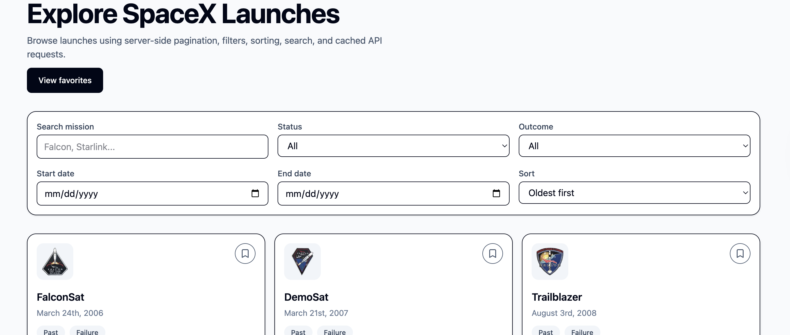
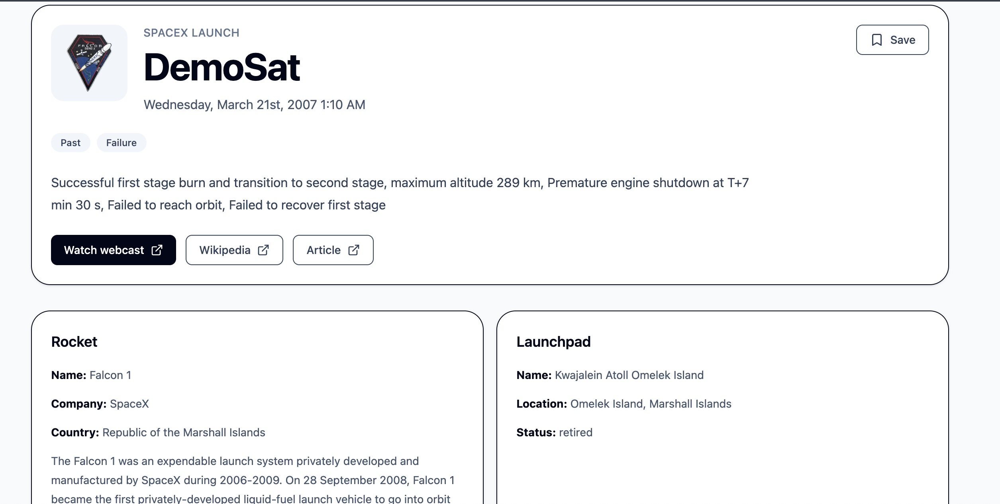
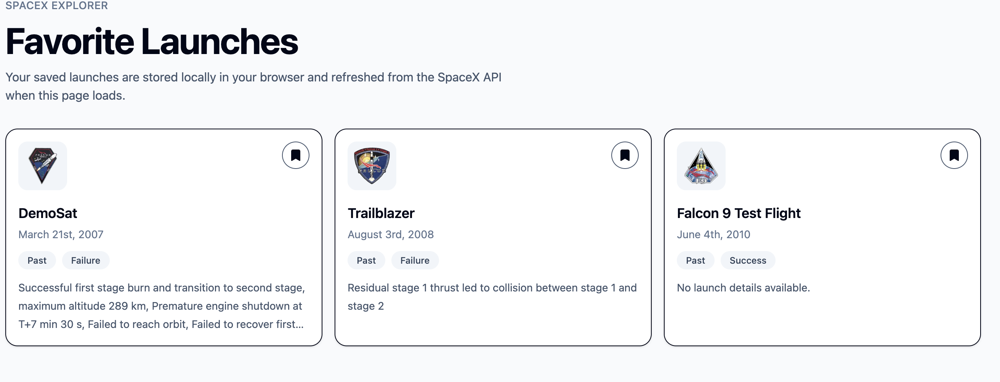

# SpaceX Explorer

A frontend SpaceX Explorer built with Next.js, React, TypeScript, TanStack Query, Tailwind CSS, and the public SpaceX REST API v4.

## Features

- Launches list using server-side pagination via `/launches/query`
- Search launches by mission name
- Filter by upcoming/past
- Filter by success/failure
- Filter by date range
- Sort by date or mission name
- Load more pagination
- Cached API requests with TanStack Query
- Retry/backoff for failed API calls
- Launch detail page
- Related rocket and launchpad data
- Flickr image gallery
- Favorites persisted in `localStorage`
- Favorites page
- Loading, empty, and error states
- Responsive UI
- Accessible labels, semantic HTML, keyboard-friendly buttons
- Virtualized launch list for performance

## Tech Stack

- Next.js App Router
- React
- TypeScript
- TanStack Query
- TanStack Virtual
- Tailwind CSS v4
- Zod
- date-fns
- lucide-react

## How to Run

```bash
npm install
npm run dev
```

## Screenshots

### Launches page



### Launch detail



### Favorites



# Architecture Review & Technical Decisions

## Project Architecture

The application uses a feature-first architecture with Next.js App Router.

```txt
app/
components/
features/
lib/
providers/
```

This structure separates routing concerns from business logic and shared infrastructure.

### Why this structure?

I wanted to avoid placing all logic inside the `app/` directory. The App Router already has a specific responsibility:

- routing
- layouts
- loading states
- error boundaries
- metadata

Keeping business logic outside `app/` improves scalability and maintainability.

---

## App Router Decision

Chose the Next.js App Router instead of the Pages Router because it is the modern routing model for Next.js and supports:

- route-level loading UI
- route-level error boundaries
- server components
- streaming support
- future React and Next.js features

### Why App Router works well here

The launches list is highly interactive and client-driven, while the detail page benefits from route-level loading and error boundaries.

The App Router also provides cleaner route organization:

```txt
app/
├── launches/
│   └── [id]/
├── favorites/
├── loading.tsx
└── error.tsx
```

### Tradeoff

The App Router introduces more complexity than the Pages Router, especially around client/server boundaries, but it is more aligned with modern Next.js applications.

---

## Feature-First Architecture

The application is organized by domain/features instead of global folders.

Example:

```txt
features/
├── launches/
└── favorites/
```

Each feature owns its:

- hooks
- API logic
- types
- schemas
- utilities
- components

### Why?

This scales better than global folders like:

```txt
hooks/
services/
types/
utils/
```

Global folders eventually become difficult to navigate as applications grow.

Feature-first organization improves:

- discoverability
- ownership
- maintainability
- scalability

---

## Data Fetching Strategy

The application uses the SpaceX REST API v4.

Main endpoints used:

```txt
POST /launches/query
GET /launches/:id
GET /rockets/:id
GET /launchpads/:id
```

### Pagination Strategy

The launches list uses server-side pagination through:

```txt
POST /launches/query
```

with this structure:

```json
{
  "query": {},
  "options": {
    "page": 1,
    "limit": 20,
    "sort": {
      "date_utc": "desc"
    }
  }
}
```

### Why server-side pagination?

Avoided fetching all launches and filtering client-side because:

- the dataset can grow over time
- it increases memory usage
- it hurts performance
- it creates unnecessary network transfer

Using server-side pagination keeps requests smaller and more scalable.

---

## TanStack Query Decision

I chose TanStack Query (React Query) for data fetching and caching.

### Why React Query?

It provides:

- caching
- deduplication
- background refresh
- retry handling
- infinite queries
- stale data management

without requiring custom state management logic.

### Why not SWR or custom fetch hooks?

React Query has stronger support for:

- infinite pagination
- advanced retries
- cache invalidation
- query composition

which fits this assignment better.

---

## Query Key Strategy

All query keys are centralized:

```txt
features/launches/api/query-keys.ts
```

Example:

```ts
launchKeys.detail(id);
```

### Why?

Centralized query keys:

- prevent duplicated key strings
- reduce mistakes
- improve maintainability
- make invalidation safer

---

## Loading and Error Handling Strategy

Although the project uses the Next.js App Router, most data fetching happens in client components through TanStack Query because the application is highly interactive.

The launches list depends on:

- filters
- search
- URL query params
- infinite pagination
- cached client-side state

For this reason, loading and error states are handled close to the data that owns them using React Query states such as:

- `isLoading`
- `isError`
- `isFetchingNextPage`
- `refetch`

The route-level `app/loading.tsx` and `app/error.tsx` are still included as fallback boundaries for unexpected route-level rendering errors, but the main user-facing loading and error experiences are controlled at the query/component level.

A more server-driven version could prefetch detail data in Server Components and hydrate React Query, but that adds complexity that is not necessary for this 3–5 hour timebox.

---

## Runtime Validation with Zod

The application uses Zod schemas for runtime validation.

### Why?

TypeScript only validates types during development/compile time.

External APIs can still return malformed data at runtime.

Zod helps ensure:

- safer parsing
- safer rendering
- more resilient UI

Example:

```ts
LaunchSchema.parse(data);
```

---

## Search Strategy

Mission search is debounced.

### Why?

Without debouncing:

```txt
s
sp
spa
spac
spacex
```

would trigger multiple API requests.

Debouncing reduces:

- unnecessary API calls
- network usage
- UI jitter

while improving performance.

---

## URL-Based Filters

Filters are stored in the URL query string.

Example:

```txt
/launches?status=past&success=success
```

### Why?

This makes filtered views:

- shareable
- refresh-safe
- bookmarkable

and improves user experience.

---

## Favorites Architecture

Favorites are stored in `localStorage`.

Only launch IDs are persisted.

Example:

```json
["launch-id-1", "launch-id-2"]
```

### Why store only IDs?

Storing entire launch objects can create stale saved data.

By storing only IDs:

- the favorites page fetches fresh launch data
- saved data stays lightweight
- storage usage stays small

### Why localStorage?

This assignment did not require authentication or backend persistence.

`localStorage` is:

- simple
- fast
- browser-persistent
- appropriate for lightweight client-side bookmarking

---

## Performance Decisions

### Virtualization

The launches grid uses TanStack Virtual with window-based virtualization.

### Why virtualization?

As more launches are loaded, rendering every card into the DOM can hurt performance.

Virtualization limits rendering to:

- visible rows
- overscanned nearby rows

This reduces:

- DOM size
- memory usage
- rendering cost

### Why window virtualization instead of container scrolling?

Used window-based virtualization to avoid nested scroll containers.

This improves:

- accessibility
- keyboard navigation
- mobile UX
- browser-native scrolling behavior

---

## Memoization

The application memoizes:

- flattened launch pages
- grouped virtualized rows
- favorite ID sets

### Why?

This prevents unnecessary recalculations during re-renders.

Avoided overusing memoization and only applied it to derived values with measurable rendering impact.

---

## Retry and Backoff Strategy

React Query retries only temporary failures:

- `429`
- `5xx`

using exponential backoff:

```txt
1s → 2s → 4s
```

### Why?

This helps:

- respect API limits
- avoid aggressive retry storms
- improve resilience against temporary outages

---

## Accessibility Decisions

Accessibility was considered throughout the UI.

### Accessibility improvements include:

- semantic HTML
- keyboard-accessible buttons
- visible focus states
- `aria-pressed` for favorites
- `aria-busy` for loading sections
- `role="alert"` for error states
- labeled form controls

### Why this matters

Accessible interfaces:

- improve usability
- support assistive technologies
- create better keyboard navigation
- improve overall UX quality

---

## Styling Decision

The application uses Tailwind CSS v4.

### Why Tailwind?

This was a timeboxed assignment.

Tailwind improves:

- development speed
- responsive styling
- consistency
- maintainability

without creating large CSS files.

### Tradeoff

Tailwind can produce long class strings, but for this assignment the speed and consistency benefits outweighed that downside.

---

## Image Optimization

Launch patches and gallery images use:

```txt
next/image
```

### Why?

This provides:

- lazy loading
- responsive image sizing
- automatic optimization
- improved performance

External image domains are explicitly configured in:

```txt
next.config.ts
```

---

## Error Handling Strategy

The application includes:

- route-level error boundaries
- reusable error state components
- retry actions

### Why?

This prevents hard crashes and gives users recovery options when API requests fail.

---

## Loading State Strategy

The application uses skeleton loaders instead of generic spinners.

### Why?

Skeletons improve perceived performance because users immediately see the layout structure while content loads.

---

## Tradeoffs & Limitations

### No backend persistence for favorites

Favorites are browser-local and not synced across devices.

### Detail page fetching

Rocket and launchpad details are fetched client-side after the launch loads.

A more advanced implementation could prefetch related resources server-side.

### Virtualized grid complexity

Responsive grid virtualization is more complex than list virtualization.

I chose a row-based virtualization strategy to keep the implementation maintainable within the project timebox.

### No automated tests yet

The current implementation focuses primarily on architecture, UX, and performance.

With more time I would add:

- More unit tests
- integration tests
- E2E tests

---

## Future Improvements

Given more time, I would add:

- Playwright E2E tests
- MSW API mocking
- launch comparison page
- charts and analytics
- offline caching
- service worker support
- dark mode
- server-side prefetching for detail pages
- dynamic virtualized measurements
- optimistic UI updates
- React Query persistence

## Checklist

- [x] App Router structure
- [x] TypeScript strict types
- [x] SpaceX `/launches/query` server-side pagination
- [x] Search by mission name
- [x] Upcoming/past filter
- [x] Success/failure filter
- [x] Date range filter
- [x] Sort by date/name
- [x] Load more pagination
- [x] React Query caching
- [x] Retry/backoff for `429` and `5xx`
- [x] Launch detail page
- [x] Rocket and launchpad related data
- [x] Flickr image gallery
- [x] Favorites persisted in `localStorage`
- [x] Favorites page
- [x] Loading skeletons
- [x] Empty states
- [x] Error states with retry
- [x] Responsive UI
- [x] Accessible labels and buttons
- [x] Virtualized launch list
- [x] Basic unit tests
- [x] README with architecture decisions and tradeoffs
